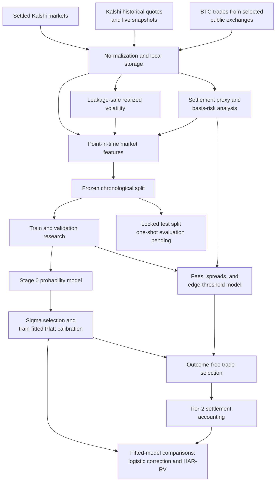
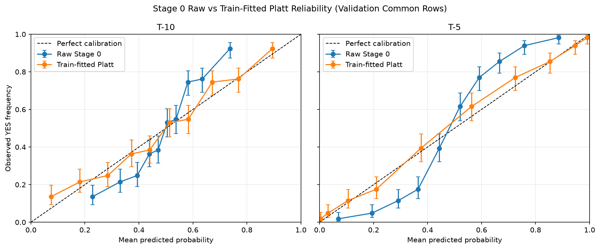
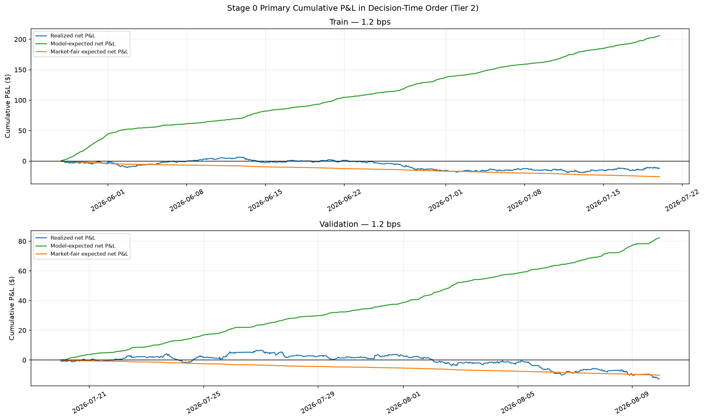
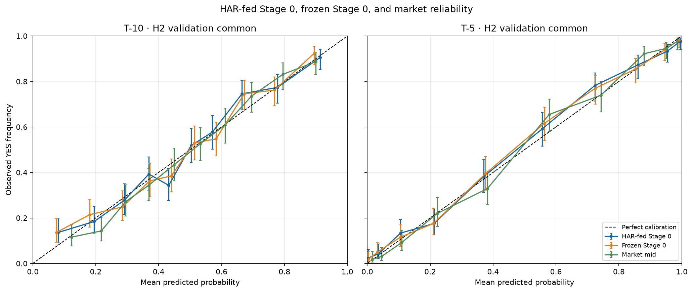

# Kalshist

Kalshist is an end-to-end Python research pipeline studying whether BTC volatility models can produce calibrated, tradable probabilities for Kalshi's 15-minute Bitcoin markets.

**Status:** The pipeline has reached forward-volatility forecasting and model comparison on validation. Strategy-level analysis, execution validation, and the one-shot locked test evaluation remain.

## Research question and market

Each `KXBTC15M` contract asks whether BTC will finish above a strike set around the market's opening reference price. Kalshi's official YES/NO settlement is the outcome of record; where both numeric fields exist, YES corresponds to an expiration value strictly above the strike. The project estimates YES probability at **T-10** and **T-5**, meaning 10 and 5 minutes before market close.

The questions are: **Are the probabilities calibrated against settled outcomes?** And **could a probability difference be traded after quoted spreads and fees?** A better forecast or a model-market disagreement alone does not answer the trading question. See [schema.md](schema.md), [feature_table_notes.md](feature_table_notes.md), and [evaluation_notes.md](evaluation_notes.md).

## Pipeline



The test branch is locked: it supplies no results or model choices at this stage.

## Data overview

The model-ready cohort covers **8,591 eligible settled markets** and **17,182 decision rows** across T-10 and T-5, with market close dates from **2026-05-26 through 2026-08-24**. These are structural cohort counts and dates, not test outcomes. [Feature-table population](feature_table_notes.md) and [split definition](evaluation_notes.md) record the assertions.

Inputs include settled Kalshi market metadata, historical quote candles, live top-of-book snapshots, and BTC trade data from Bullish, Kraken, and Crypto.com. The exchange-derived BTC reference supports volatility features and a separate settlement-proxy/basis-risk check; Kalshi's settlement remains authoritative for contract payoff. See [exchange notes](exchange_notes.md) and [quote notes](quote_notes.md).

Research datasets and most derived artifacts are stored locally under `data/` and are intentionally not committed. The repository contains code, research records, selected plots, and small public-metadata snapshots.

## Methodology and evaluation integrity

- Realized-volatility windows use observations strictly before each decision timestamp; missing-data coverage is checked rather than silently filled across long gaps. [Feature notes](feature_notes.md)
- The feature table separates permitted inputs from targets and `FUTURE_ONLY` columns. Safe-column assertions guard model and trade-selection inputs. [Feature-table notes](feature_table_notes.md), [schema](schema.md)
- The split is chronological by market `close_date`, with asserted row counts and no ticker shared across splits. The T-10 and T-5 rows of one market stay together. [Evaluation design](evaluation_notes.md)
- The test split is reserved for one outcome-derived evaluation after the strategy and rules are frozen. Its outcomes have not been read for research results. [Evaluation design](evaluation_notes.md)
- Sigma selection, calibration, thresholds, fitted-model comparisons, and permitted validation uses follow recorded protocols and a validation-query ledger. Validation has informed choices, so it is not a pristine untouched holdout. [Evaluation design](evaluation_notes.md)
- Trade decisions are selected and fingerprinted before settlement outcomes are joined. Economic uncertainty is assessed across trading days rather than treating adjacent trades as independent. [Backtest notes](backtest_notes.md), [model notes](model_notes.md)

## Evaluation tiers

**Tier 1** evaluates probabilities against outcomes without trading prices. **Tier 2** is a historical, quote-aware simulation using recorded top-of-book prices, modeled fees, and settlement accounting; it has no historical depth or fill-size proof. **Tier 3** would require execution evidence for size, fills, and latency. Current P&L results are **Tier 2**. [Quote notes](quote_notes.md), [execution notes](execution_notes.md)

## Results so far

All findings below concern train or validation research, not the locked test split.

| Stage | Finding and interpretation | Record |
| --- | --- | --- |
| Settlement proxy | In the sampled aggregate check, the exchange-derived BTC proxy was sufficiently close for feature research, but imperfect and distinct from Kalshi's official reference. | [Exchange notes](exchange_notes.md) |
| Stage 0 selection and calibration | `5min_ewma_vol` was selected. On validation common rows, train-fitted Platt calibration improved Brier score and log loss at both decision horizons; the market quote mid still had lower Brier score at both. | [Calibration notes](calibration_notes.md) |
| Basis sensitivity | Plausible BTC-reference differences can move calibrated probabilities by amounts economically meaningful relative to the model-market gap. | [Calibration notes](calibration_notes.md) |
| Stage 0 historical trading | **No Tier-2 evidence of edge either way; not established.** The primary validation net P&L estimate was negative, and its traded-day-clustered interval included zero. | [Backtest notes](backtest_notes.md) |
| Logistic correction | **Category C — no meaningful difference; did not beat Stage 0.** The frozen train-only comparison did not meet its probability or paired economic improvement rule. | [Model notes](model_notes.md) |
| HAR-RV forecast and probability swap | HAR added forward-volatility forecast skill at both horizons under the frozen validation rule (**V1/V1**). Feeding those forecasts into Stage 0 did **not** meaningfully improve its probabilities (**P3**); Stage 0 remains the baseline of record. | [Model notes](model_notes.md) |

The simple, calibrated Stage 0 baseline has not been meaningfully beaten on validation. Better volatility forecasts did not automatically yield better event probabilities, and the market mid had lower Brier scores than the tested models on their reported common rows. No tradable edge has been established. The locked test period remains unread.

## Figures



*Validation common rows: raw Stage 0 versus train-fitted Platt reliability at both decision horizons. Error bars show uncertainty around observed YES frequencies.*



*Primary Stage 0 Tier-2 simulation on train and validation: realized, model-expected, and market-fair cumulative P&L. These curves do not represent live trading.*



*Validation common rows: train-only HAR-fed Stage 0, frozen Stage 0, and market-mid reliability at T-10 and T-5. The probability verdict uses the recorded paired Brier rule, not a visual reading of this plot.*

## Simulated versus real

**No live orders were placed and no real money was traded.** Reported trading P&L is historical Tier-2 simulation. It assumes one-contract taker entry at recorded top-of-book quotes, applies the frozen fee model, and holds each position to Kalshi settlement. Historical depth, fillable size, latency, and realized slippage are not modeled. A live quote recorder has captured top-of-book snapshots for later execution-validation work; those observations are not live fills. [Execution notes](execution_notes.md), [backtest notes](backtest_notes.md)

## Limitations

- Historical quote candles lack displayed size and full order-book depth; Tier-3 execution validation is still pending. [Quote notes](quote_notes.md)
- A small number of markets have reproducible upstream candle gaps; missing candles were not synthesized. [Quote notes](quote_notes.md)
- The exchange-derived settlement proxy is not Kalshi's official settlement index. [Exchange notes](exchange_notes.md)
- Validation spans three weeks and has informed model-error and threshold decisions; it is not an untouched final holdout. [Evaluation design](evaluation_notes.md), [backtest notes](backtest_notes.md)
- Train and validation differ in volatility regime, limiting simple extrapolation of validation findings. [Evaluation design](evaluation_notes.md)

## Project status

**Completed:** local data and feature pipeline; leakage and split checks; settlement-proxy/basis analysis; Stage 0 sigma selection and calibration; fee, spread, and edge-threshold analysis; Tier-2 Stage 0 backtest; logistic comparison; HAR-RV forecast and probability comparison on validation.

**Remaining:** conditional gradient-boosting gate and candidate economic comparison; strategy sizing, risk, and regime analysis; live-data execution validation; one-shot locked test evaluation; live feature generation and paper trading. These are planned work, not completed results.

Last updated: 2026-09-30

## Repository layout and technical records

```text
.
├── README.md          Project overview and current findings
├── ARCHITECTURE.md    Pipeline stages and technical navigation
├── storage.py         Shared local daily-storage helpers
├── scripts/           Data, feature, model, check, and analysis code
├── data/              Mostly local, untracked datasets and derived artifacts
└── *_notes.md         Chronological technical research records
```

| Question | Start here |
| --- | --- |
| Pipeline stages and implementation map | [Architecture](ARCHITECTURE.md) |
| Fields, timestamps, and artifact roles | [Schema](schema.md), [feature-table notes](feature_table_notes.md) |
| BTC sources, reference price, and basis risk | [Exchange notes](exchange_notes.md), [feature notes](feature_notes.md) |
| Kalshi quotes and coverage | [Quote notes](quote_notes.md) |
| Split, locked test, and validation-use rules | [Evaluation notes](evaluation_notes.md) |
| Stage 0 choice and calibration | [Calibration notes](calibration_notes.md) |
| Fees, spreads, thresholds, and fill assumptions | [Execution notes](execution_notes.md) |
| Historical trading results | [Backtest notes](backtest_notes.md) |
| Logistic and HAR-RV comparisons | [Model notes](model_notes.md) |

The technical notes are chronological research records; some headings retain internal development-session labels for provenance.

## Setup and reproducibility

The frozen analysis environment used **Python 3.13.7**; package versions are recorded in [model notes](model_notes.md). `requirements.txt` pins the recorded dependencies. From the repository root:

```bash
python3 -m venv .venv
source .venv/bin/activate
python -m pip install -r requirements.txt
```

Scripts use the module form `python -m scripts.<name>` from the repository root. Public endpoints used by the project require no credentials. Data-fetching and builder scripts write local artifacts, so inspect a script before running it.

A clone makes the code, methods, research records, tracked plots, and selected public metadata inspectable. It does **not** include the research datasets or many derived artifacts. Public data sources are described, but exact historical reconstruction is not guaranteed and is not the purpose of this public repository. Live-recorder snapshots cannot be reproduced retrospectively.
